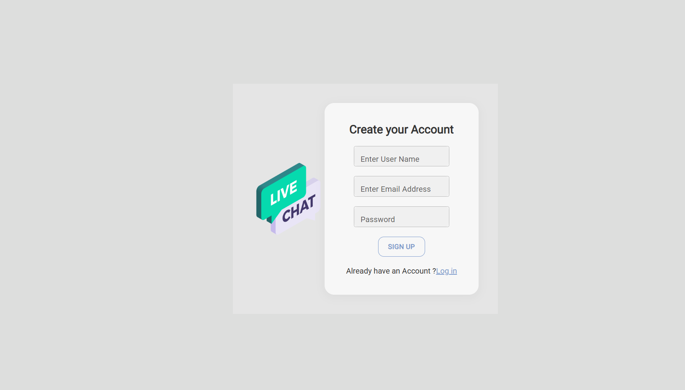

# 💬 Live Chat Application — ChatConnect

## 🏢 Company: CODTECH IT SOLUTIONS

* **Name**: SORNAHARINI.D  
* **Intern ID**: CT08DM1085  
* **Domain**: MERN Stack Web Development  
* **Duration**: 8 Weeks

---

## 🌐 Live Project Links

* 🔗 **Frontend**: [https://visionary-maamoul-6bf605.netlify.app/](https://visionary-maamoul-6bf605.netlify.app/)
* 🔗 **Backend**: [https://livechats.onrender.com](https://livechats.onrender.com)

---

## 📝 About the Project

As part of my internship at **CodTech IT Solutions**, I developed a full-stack **Live Chat Application** using the MERN stack, combined with **Socket.IO** for real-time communication. This platform enables multiple users to join a chat room, send and receive messages instantly, and interact with a clean, responsive user interface.

The project enhances communication efficiency and demonstrates real-time web capabilities.

---

## 🎯 Objective

To create a real-time messaging app that:

* Supports instant chat functionality via WebSockets  
* Is accessible on both desktop and mobile devices  
* Offers a visually appealing and smooth user experience  
* Demonstrates strong full-stack development and deployment skills

---

## 🧱 Tech Stack

* **Frontend**: React.js  
* **Backend**: Node.js, Express.js  
* **Real-time Communication**: Socket.IO  
* **Styling**: Custom CSS (no Bootstrap or Tailwind used)  
* **Hosting**: Netlify (frontend), Render (backend)

---

## ⚙️ Features

* 👥 Join screen for entering username, selecting avatar, and optional details  
* 📱 Fully responsive design with media queries  
* 💬 Real-time message broadcasting using Socket.IO  
* 🧭 Navigation bar with user details and logout  
* 🔁 Handles user connect/disconnect events gracefully  
* 🧪 Stable across different browsers and devices

---

## 🛠️ Development Highlights

### ✅ Frontend

* Built using **React.js**  
* Responsive UI designed with **pure CSS**  
* Utilized **React Hooks**: `useState`, `useEffect`, `useRef`  
* Clean component structure with reusable logic  
* Seamless socket connection and state updates

### ✅ Backend

* Built with **Express.js** and **Node.js**  
* Managed real-time socket connections via **Socket.IO**  
* Broadcasts messages and maintains a list of connected users  
* CORS and environment variable configurations for secure integration

---

## 🚀 Deployment

* **Frontend** deployed using **Netlify**  
* **Backend** deployed on **Render**  
* Environment variables are securely handled  
* CI/CD integration for automated deployment updates

---

## 🧪 Testing

Manually tested across multiple devices and browsers to ensure:

* ✅ Instant message delivery  
* ✅ Responsive design adaptability  
* ✅ Stable connection on user activity  
* ✅ Input validation and clean UI feedback

---

## 🖼️ Output Preview

Here’s a glimpse of the Live Chat Application in action:

---

## ✅ Outcome

* Developed a scalable, real-time chat platform  
* Improved skills in React, Socket.IO, and full-stack integration  
* Gained hands-on experience in deploying cloud applications  
* Delivered a responsive and stable solution for real-time communication

---

